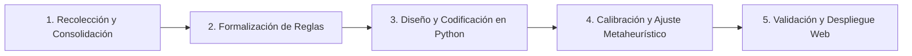

# Timetabling Colegio Madres Dominicas (MMDD)
### Herramienta de Apoyo Algorítmico para la Programación de Horarios Escolares — Año Escolar 2026

[](https://www.udec.cl)
[-A32638?style=flat-square)](#-créditos-y-equipo)
[](https://www.python.org/)
[](#-metodología-de-solución)

Este repositorio contiene el desarrollo, formulación matemática, algoritmos de optimización (metaheurísticas) y plataforma de visualización para la **generación y programación automatizada de horarios semanales** del **Colegio Madres Dominicas** (Concepción, Chile). El modelo está parametrizado con los **datos oficiales del año escolar 2026** (`data/Data 2026`).

---

## 📋 Tabla de Contenidos
1. [Introducción y Contexto del Proyecto](#-introducción-y-contexto-del-proyecto)
2. [Fuentes de Datos y Cambios respecto de 2024](#-fuentes-de-datos-y-cambios-respecto-de-2024)
3. [Estructura de Cursos y Niveles](#-estructura-de-cursos-y-niveles)
4. [Parámetros del Sistema: Dotación Docente 2026](#-parámetros-del-sistema-dotación-docente-2026)
5. [Cargas Horarias Curriculares por Nivel](#-cargas-horarias-curriculares-por-nivel)
6. [Estructura de Bloques Horarios y Jornadas](#-estructura-de-bloques-horarios-y-jornadas)
7. [Formación Diferenciada: Franjas de Electivos](#-formación-diferenciada-franjas-de-electivos)
8. [Recintos Deportivos y Salas](#-recintos-deportivos-y-salas)
9. [Restricciones del Modelo de Optimización](#-restricciones-del-modelo-de-optimización)
10. [Supuestos e Inconsistencias de los Datos 2026](#-supuestos-e-inconsistencias-de-los-datos-2026)
11. [Arquitectura y Estructura del Repositorio](#-arquitectura-y-estructura-del-repositorio)
12. [Metodología de Solución](#-metodología-de-solución)
13. [Plataforma de Ejecución y Salidas Excel](#-plataforma-de-ejecución-y-salidas-excel)
14. [Créditos y Equipo](#-créditos-y-equipo)

---

## 🏫 Introducción y Contexto del Proyecto

El **Colegio Madres Dominicas** es un establecimiento educacional con más de 130 años de historia ubicado en Concepción, Chile, que imparte enseñanza desde preescolar hasta 4° año de enseñanza media con jornada escolar completa.

### La Problemática: School Timetabling Problem (STP)
Tradicionalmente, la construcción de la malla horaria escolar se realiza de manera **manual**, basándose en métodos de prueba y error sobre planillas de cálculo. Esta tarea enfrenta una complejidad combinatoria crítica debido a:
* **Heterogeneidad de jornadas:** Cada curso termina su jornada en bloques distintos según el día de la semana (incluso cursos paralelos A y B pueden diferir).
* **Recursos compartidos:** Profesores de asignaturas especializadas, gimnasios y salas de especialidad compartidos entre múltiples niveles.
* **Co-docencia:** Las horas de *English skills* y el bloque de Artes/Música de enseñanza media requieren **dos docentes en el mismo bloque**.
* **Electivos de formación diferenciada en 3° y 4° medio:** Los estudiantes de los cursos A y B se mezclan en secciones electivas simultáneas, obligando a coordinar bloques idénticos y sin solapamiento con el plan común.

### Objetivo General
Diseñar e implementar una **herramienta algorítmica basada en Python y metaheurísticas de optimización combinatoria** capaz de generar mallas horarias factibles, libres de colisiones y que optimicen la distribución de carga académica tanto para estudiantes como para docentes.

---

## 🗂️ Fuentes de Datos y Cambios respecto de 2024

El modelo se alimenta de dos documentos oficiales del colegio para el año 2026:

| Archivo | Contenido utilizado |
| :--- | :--- |
| `data/Data 2026/HORARIO CURSOS 2026.xlsx` | Bloques y horarios, jornada de cada curso, horas por asignatura, franjas de electivos, gimnasios, salas, bloqueos de pastoral y diseño de las planillas (incluido el escudo del colegio). |
| `data/Data 2026/DISTRIBUCIÓN HORARIA 2026.docx` | Dotación docente (37 docentes) y asignación profesor–curso–asignatura, jefaturas, *English skills*, intervención y ACLE. |

Los datos de 2024 (`data/Data 2024`) se conservan como referencia histórica. Principales cambios incorporados al modelo:

| Parámetro | 2024 | 2026 |
| :--- | :---: | :---: |
| Duración de los bloques | 45 min (bloques 6 a 10 de 40 min) | **45 min todos** |
| Fin de jornada (bloque 8) / lunes 3°–4° medio | 14:20 / 16:10 | **14:40 / 16:40** |
| Carga 1° a 4° básico | 36 h (Matemática 6 h) | **38 h (Matemática 8 h)** |
| Carga 5° básico | 37 h (Matemática 6 h) | **38 h (Matemática 7 h)** |
| Dotación docente | 46 registros (con duplicados en 5° y 6°) | **37 docentes** |
| *English skills* (2 docentes) | Implícito, sin marcar | **2° básico a 2° medio, 2 de las 6 h de inglés** |
| Electivos de 4° medio | Taller de Literatura | **Diseño y Arquitectura** (sale Taller de Literatura) |
| Uso de gimnasios | Mixto | **Gimnasio A: 5° básico–4° medio · Gimnasio B: 1°–4° básico y párvulos** |
| Salas registradas | 8 | **12** (se suman las salas de 3°A, 3°B, 4°A y 4°B) |

---

## 🎓 Estructura de Cursos y Niveles

El modelo programa formalmente **24 cursos regulares** (2 cursos paralelos, A y B, por cada nivel desde 1° básico hasta 4° medio):

| Ciclo Educativo | Niveles Comprendidos | N° Cursos por Nivel | Total Cursos |
| :--- | :--- | :---: | :---: |
| **Primer Ciclo Básico** | 1° Básico, 2° Básico, 3° Básico, 4° Básico | 2 (A y B) | **8 cursos** |
| **Segundo Ciclo Básico (Inicial)** | 5° Básico, 6° Básico | 2 (A y B) | **4 cursos** |
| **Segundo Ciclo Básico (Superior)** | 7° Básico, 8° Básico | 2 (A y B) | **4 cursos** |
| **Enseñanza Media (Inicial)** | 1° Medio, 2° Medio | 2 (A y B) | **4 cursos** |
| **Enseñanza Media (Diferenciada)** | 3° Medio, 4° Medio | 2 (A y B) | **4 cursos** |
| **Total Global del Modelo** | **1° Básico a 4° Medio** | **2 por nivel** | **24 cursos** |

> **Nota sobre Educación Parvularia:**
> El colegio cuenta además con **Prekínder A, Kínder A y Kínder B**. El motor programa únicamente su **Educación Física** (2 bloques simples semanales en días distintos, con *Ed. Física 2*), porque comparte docente y Gimnasio B con 1° a 4° básico. El resto de la jornada parvularia no forma parte del modelo.

---

## 👥 Parámetros del Sistema: Dotación Docente 2026

La planta docente de `DISTRIBUCIÓN HORARIA 2026.docx` contempla **37 docentes**, identificados por su área tal como en el documento oficial:

| Departamento | N° | Docentes | Cobertura y funciones |
| :--- | :---: | :--- | :--- |
| **Lenguaje y Filosofía** | 5 | `Lenguaje 1` a `Lenguaje 5` | Lenguaje de 5° básico a 4° medio; electivos *Lectura y Escritura Especializada* (3°) y *Participación y Argumentación en Democracia* (4°). `Lenguaje 5` dicta **Filosofía** en 3° y 4° medio. |
| **Matemática** | 4 | `Matemática 1` a `Matemática 4` | Matemática de 5° básico a 4° medio; electivos *Probabilidades y Estadística* (3°) y *Límites, Derivadas e Integrales* (4°). `Matemática 2` tiene además 24 h de intervención en media y 2 h de ACLE. |
| **Inglés** | 5 | `Inglés 1` a `Inglés 5` | Inglés de 1° básico a 4° medio y co-docencia de *English skills*. |
| **Historia** | 3 | `Historia 1` a `Historia 3` | Historia de 5° básico a 2° medio, Educación Ciudadana en 3° y 4° medio, electivos *Comprensión Histórica del Presente*, *Economía y Sociedad* (3°) y *Geografía, Territorio y Problemas Socioambientales* (4°). |
| **Ciencias y Religión** | 6 | `Química`, `Biología`, `C. Naturales y Religión`, `C. Naturales`, `Física`, `Religión` | Ciencias Naturales de 5° a 8° básico, Biología, Química y Física en media, Ciencias para la Ciudadanía, electivos de ciencias. `C. Naturales y Religión` combina Ciencias (7° y 8°A) con Religión de 7° básico a 4° medio; `Religión` dicta de 1° a 6° básico. |
| **Artes, Tecnología y Música** | 3 | `Artes y Tecnología 1`, `Artes y Tecnología 2`, `Música` | Los dos docentes mixtos se reparten Artes y Tecnología de 5° básico a 4° medio y el electivo *Diseño y Arquitectura* (4°A y 4°B); `Música` dicta de 5° básico a 4° medio. |
| **Educación Física** | 3 | `Ed. Física 1` a `Ed. Física 3` | Desde párvulos hasta 4° medio. |
| **Educación General Básica** | 8 | `Básica 1` a `Básica 8` | 1° a 4° básico: cada docente dicta Matemática **o** Lenguaje en los cursos A y B de un nivel, más C. Sociales, C. Naturales, Artes, Música y Orientación/Tecnología de su curso de jefatura. Siete de ellas tienen 6–7 h de intervención. |
| **Total** | **37** | | |

### Profesores Jefes 2026

| Curso | Jefatura | Curso | Jefatura | Curso | Jefatura |
| :--- | :--- | :--- | :--- | :--- | :--- |
| 1° Básico A | Básica 1 | 5° Básico A | Historia 2 | 1° Medio A | Química |
| 1° Básico B | Básica 2 | 5° Básico B | Inglés 1 | 1° Medio B | Inglés 5 |
| 2° Básico A | Básica 3 | 6° Básico A | Inglés 4 | 2° Medio A | Matemática 1 |
| 2° Básico B | Básica 4 | 6° Básico B | C. Naturales | 2° Medio B | Lenguaje 4 |
| 3° Básico A | Básica 5 | 7° Básico A | C. Naturales y Religión | 3° Medio A | Matemática 3 |
| 3° Básico B | Básica 6 | 7° Básico B | Inglés 3 | 3° Medio B | Lenguaje 1 |
| 4° Básico A | Básica 7 | 8° Básico A | Historia 1 | 4° Medio A | Lenguaje 3 |
| 4° Básico B | Básica 8 | 8° Básico B | Matemática 2 | 4° Medio B | Inglés 2 *(supuesto)* |

---

## 📚 Cargas Horarias Curriculares por Nivel

Cada curso cuenta con una exigencia semanal de horas pedagógicas (bloques de 45 minutos), validada con las tablas de horas de `HORARIO CURSOS 2026.xlsx`. La carga de cada curso coincide exactamente con su jornada, por lo que **no quedan bloques libres**.

> **English skills:** de 2° básico a 2° medio, **2 de las 6 horas de Inglés** se dictan con **dos docentes simultáneos** (marcadas en amarillo en las planillas). 1° básico y 3°–4° medio no tienen *English skills*.

### 1. Primer Ciclo Básico: 1°, 2°, 3° y 4° Básico
> **Carga Semanal Total:** 38 horas pedagógicas

* **Lenguaje y Comunicación:** 8 horas
* **Educación Matemática:** 8 horas *(sube desde 6 h en 2024)*
* **Idioma Extranjero Inglés:** 6 horas *(2° a 4°: 4 h + 2 h de English skills)*
* **Ciencias Sociales / Historia:** 3 horas
* **Ciencias Naturales:** 3 horas
* **Artes Visuales:** 2 horas
* **Música:** 2 horas
* **Educación Física y Salud:** 3 horas
* **Religión:** 2 horas
* **Orientación y Tecnología (Integrada):** 1 hora *(bloque `ORIEN/TEC.` a cargo del profesor/a jefe; equivale a 0,5 h de Orientación + 0,5 h de Tecnología)*

### 2. Segundo Ciclo Básico: 5° y 6° Básico
> **Carga Semanal Total:** 38 horas en 5° básico · 37 horas en 6° básico

* **Lenguaje y Comunicación:** 6 horas
* **Educación Matemática:** 7 horas en 5° básico · 6 horas en 6° básico
* **Idioma Extranjero Inglés:** 6 horas (4 h + 2 h de English skills)
* **Historia, Geografía y Ciencias Sociales:** 4 horas
* **Ciencias Naturales:** 4 horas
* **Educación Tecnológica:** 2 horas
* **Artes Visuales:** 2 horas
* **Música:** 2 horas
* **Educación Física y Salud:** 2 horas
* **Orientación:** 1 hora
* **Religión:** 2 horas

### 3. Segundo Ciclo Básico Superior: 7° y 8° Básico
> **Carga Semanal Total:** 37 horas pedagógicas

* **Lenguaje y Comunicación:** 6 horas
* **Educación Matemática:** 6 horas
* **Idioma Extranjero Inglés:** 6 horas (4 h + 2 h de English skills)
* **Historia, Geografía y Ciencias Sociales:** 4 horas
* **Ciencias Naturales:** 4 horas
* **Física:** 1 hora
* **Educación Tecnológica:** 1 hora
* **Artes Visuales:** 2 horas
* **Música:** 2 horas
* **Educación Física y Salud:** 2 horas
* **Orientación:** 1 hora
* **Religión:** 2 horas

### 4. Enseñanza Media Inicial: 1° y 2° Medio
> **Carga Semanal Total:** 40 horas pedagógicas

* **Lenguaje y Comunicación:** 6 horas
* **Educación Matemática:** 7 horas
* **Idioma Extranjero Inglés:** 6 horas (4 h + 2 h de English skills)
* **Historia, Geografía y Ciencias Sociales:** 4 horas
* **Biología:** 4 horas
* **Química:** 2 horas
* **Física:** 2 horas
* **Educación Tecnológica:** 2 horas
* **Artes Visuales / Música:** 2 horas *(bloque `ARTES-MÚSICA`: el curso se divide y ambos docentes dictan en simultáneo)*
* **Educación Física y Salud:** 2 horas
* **Orientación:** 1 hora
* **Religión:** 2 horas

### 5. Enseñanza Media Superior: 3° y 4° Medio
> **Carga Semanal Total:** 42 horas pedagógicas (24 horas Plan Común + 18 horas de Formación Diferenciada)

**Plan Común (24 horas pedagógicas):** Lenguaje 3, Matemática 3, Inglés 4, Educación Ciudadana 2, Ciencias para la Ciudadanía 2, Filosofía 2, Física 1, Artes Visuales / Música 2 *(co-docencia)*, Educación Física 2, Orientación 1 y Religión 2.

**Formación Diferenciada (18 horas pedagógicas):** 3 franjas de 6 horas, cada una con varios electivos dictados en paralelo (ver sección siguiente).

---

## ⏱️ Estructura de Bloques Horarios y Jornadas

Todos los bloques duran **45 minutos**. Los bloques dobles (90 minutos) se forman con los pares 1-2, 3-4, 5-6, 7-8 y 9-10, que nunca cruzan un recreo:

| Bloque | Horario | | Bloque | Horario |
| :---: | :---: | :---: | :---: | :---: |
| 1 | 08:00 - 08:45 | | 6 | 12:15 - 13:00 |
| 2 | 08:45 - 09:30 | | *Recreo* | *13:00 - 13:10* |
| *Recreo* | *09:30 - 09:45* | | 7 | 13:10 - 13:55 |
| 3 | 09:45 - 10:30 | | 8 | 13:55 - 14:40 |
| 4 | 10:30 - 11:15 | | *Colación* | *14:40 - 15:10* |
| *Recreo* | *11:15 - 11:30* | | 9 | 15:10 - 15:55 |
| 5 | 11:30 - 12:15 | | 10 | 15:55 - 16:40 |

Jornada de cada curso (último bloque lectivo de cada día), según las mallas 2026:

| Curso | Lunes | Martes | Miércoles | Jueves | Viernes | Total |
| :--- | :---: | :---: | :---: | :---: | :---: | :---: |
| **1° a 4° Básico** (A y B) | 1–8 | 1–8 | 1–7 | 1–8 | 1–7 | **38** |
| **5° Básico A** | 1–8 | 1–8 | 1–8 | 1–6 | 1–8 | **38** |
| **5° Básico B** | 1–8 | 1–8 | 1–8 | 1–8 | 1–6 | **38** |
| **6° y 7° Básico** (A y B) | 1–8 | 1–8 | 1–7 | 1–8 | 1–6 | **37** |
| **8° Básico A** | 1–6 | 1–8 | 1–7 | 1–8 | 1–8 | **37** |
| **8° Básico B** | 1–8 | 1–8 | 1–7 | 1–8 | 1–6 | **37** |
| **1° y 2° Medio** | 1–8 | 1–8 | 1–8 | 1–8 | 1–8 | **40** |
| **3° y 4° Medio** | 1–10 *(tarde)* | 1–8 | 1–8 | 1–8 | 1–8 | **42** |
| **Párvulos** *(supuesto, solo Ed. Física)* | 1–6 | 1–6 | 1–6 | 1–6 | 1–6 | 2 |

> Los bloques 9 y 10 (posteriores a la colación) se usan **solo los lunes en 3° y 4° medio**.

---

## 🎯 Formación Diferenciada: Franjas de Electivos

Las 18 horas de electivos de cada nivel se organizan en **3 franjas institucionales de 6 horas** (3 periodos dobles), fijas según la grilla oficial 2026 y compartidas por los cursos A y B. En cada franja se dicta un electivo propio de la franja y tres electivos que rotan en 3 secciones (S.1, S.2 y S.3). Las franjas de 3° y 4° medio nunca se superponen, por lo que un mismo docente puede dictar en ambos niveles.

### 3° Medio

| Franja | Periodos dobles | Electivos (docente → sala) |
| :---: | :--- | :--- |
| **1** | Lun 3-4 · Mar 7-8 · Jue 5-6 | Comprensión Histórica del Presente 3AB (Historia 3 → Sala 3°A) · Lectura y Escritura S.1 (Lenguaje 1 → Sala 3°B) · Química S.1 (Química → Electivo 2) · Economía S.1 (Historia 1 → Electivo 3) |
| **2** | Lun 7-8 · Mié 1-2 · Jue 3-4 | Probabilidades y Estadística 3AB (Matemática 1 → Sala 3°A) · Lectura y Escritura S.2 (Lenguaje 1 → Sala 3°B) · Química S.2 (Química → Electivo 2) · Economía S.2 (Historia 1 → Electivo 3) |
| **3** | Mar 5-6 · Mié 3-4 · Jue 7-8 | Biología Celular y Molecular 3AB (Biología → Sala 3°A) · Lectura y Escritura S.3 (Lenguaje 4 → Sala 3°B) · Química S.3 (Química → Electivo 2) · Economía S.3 (Historia 2 → Electivo 3) |

### 4° Medio

| Franja | Periodos dobles | Electivos (docente → sala) |
| :---: | :--- | :--- |
| **1** | Mar 1-2 · Mié 7-8 · Vie 1-2 | Diseño y Arquitectura 4A (Artes y Tecnología 1 → Sala 4°A) y 4B (Artes y Tecnología 2 → Sala 4°B) · Límites S.1 (Matemática 3 → Electivo 2) · Participación y Argumentación S.1 (Lenguaje 1 → Sala de Tecnología) · Geografía S.1 (Historia 3 → Electivo 3) |
| **2** | Mar 3-4 · Mié 5-6 · Vie 3-4 | Biología de los Ecosistemas 4A (Biología → Sala 4°A) y 4B (C. Naturales → Electivo 3) · Límites S.2 (Matemática 1 → Electivo 2) · Participación y Argumentación S.2 (Lenguaje 1 → Sala de Tecnología) · Geografía S.2 (Historia 3 → Sala 4°B) |
| **3** | Lun 1-2 · Jue 1-2 · Vie 5-6 | Ciencias para la Salud 4AB (C. Naturales → Sala 4°B) · Límites S.3 (Matemática 1 → Electivo 2) · Participación y Argumentación S.3 (Lenguaje 2 → Sala 4°A) · Geografía S.3 (Historia 3 → Electivo 3) |

---

## 🏟️ Recintos Deportivos y Salas

* **Recintos deportivos (un curso por bloque en cada uno):**
  * **Gimnasio A:** Educación Física de 5° básico a 4° medio.
  * **Gimnasio B:** Educación Física de 1° a 4° básico y párvulos.
  * **Patio Santo Domingo:** recibe el desborde de cualquiera de los gimnasios; su uso se penaliza en la función objetivo (en los datos oficiales 2026 no se usa).
* **Salas registradas (12):** *Electivo 1* (English skills, un curso por bloque), *Electivo 2*, *Electivo 3*, *Sala de Tecnología*, *Sala Padre Cueto*, *Sala Madre Pilar*, *Sala de Artes* (Artes de media), *Sala de Música* (Música de 5° básico a 4° medio) y las salas de *3°A, 3°B, 4°A y 4°B* para electivos.
* **Bloqueos de pastoral:** Sala de Tecnología, Electivos 2 y 3, Sala Padre Cueto, Sala Madre Pilar, Sala de Artes y párvulos tienen franjas reservadas (principalmente colación y bloques 9-10 de martes y jueves; además martes 1-2 y jueves 1-4 en Madre Pilar y jueves 7-8 en Padre Cueto).

---

## 🔒 Restricciones del Modelo de Optimización

El problema de asignación diferencia estrictamente entre restricciones duras (factibilidad) y blandas (calidad de servicio). Todas las restricciones duras se verifican de forma independiente en la auditoría (`ValidadorRestricciones`).

### 1. Restricciones Duras (Hard Constraints)
Deben cumplirse en el 100% de los casos para que un horario sea considerado factible:

1. **Asignación docente oficial:** Cada asignatura de cada curso la dicta el docente indicado en `DISTRIBUCIÓN HORARIA 2026.docx` (ver tabla de dotación).
2. **No Solapamiento Docente (Clash-Free Teacher):** Un docente no puede atender más de un curso o grupo en un mismo bloque. En las lecciones con co-docencia, todos los docentes involucrados deben estar libres; un electivo compartido por A y B cuenta como un solo grupo.
3. **Ocupación Única y Jornada Completa:** Cada curso recibe exactamente una actividad por bloque de su jornada, sin huecos y sin bloques fuera de ella.
4. **Cumplimiento Estricto de Cargas Horarias:** Las horas asignadas por asignatura coinciden exactamente con la malla (38 h en 1°–5° básico, 37 h en 6°–8° básico, 40 h en 1°–2° medio y 42 h en 3°–4° medio).
5. **Orientación y Jefatura:** La Orientación (y el bloque `ORIEN/TEC.` de 1° a 4° básico) está a cargo del profesor/a jefe de cada curso.
6. **Franjas de Electivos Sincronizadas (3° y 4° Medio):** Las 3 franjas de cada nivel ocupan bloques idénticos en las secciones A y B, sin choques con el plan común.
7. **Recintos Deportivos:** Un curso por recinto y bloque; cada curso usa el gimnasio de su ciclo y solo el desborde va al Patio Santo Domingo.
8. **English skills:** Se dicta con sus dos docentes simultáneos, en la sala *Electivo 1*, que admite un curso por bloque.
9. **Una Sesión Diaria por Asignatura:** Ninguna asignatura se reparte en dos sesiones el mismo día (las English skills cuentan como Inglés).
10. **Bloques Pedagógicos Dobles:** Las asignaturas se programan en pares de 90 minutos dentro de un par pedagógico; solo las horas impares (p. ej. 3 h de Ciencias Naturales o 7 h de Matemática) agregan un bloque simple en otro día. Las troncales (Matemática, Lenguaje y Ciencias) nunca quedan partidas en el mismo día.
11. **Bloqueos de Pastoral:** Ninguna actividad programada ocupa una sala en una franja reservada para pastoral.

### 2. Restricciones Blandas / Criterios de Calidad (Soft Constraints)
* **Uso del Patio Santo Domingo** *(implementado en la función objetivo)*: se penaliza cada bloque de Educación Física que no cabe en el gimnasio de su ciclo.
* **Porcentaje de bloques dobles y ventanas docentes** *(medidos en la auditoría)*: proporción de horas en pares de 90 minutos y bloques libres intermedios en la jornada de cada docente.
* **Pendiente de incorporar a la optimización:** minimizar las ventanas docentes, distribuir las asignaturas de alta carga cognitiva a lo largo de la semana y balancear la carga diaria de cada curso.

---

## ⚠️ Supuestos e Inconsistencias de los Datos 2026

Los documentos oficiales contienen algunas inconsistencias. El modelo adopta los siguientes supuestos, que conviene **confirmar con el colegio**:

| Situación en los datos | Supuesto adoptado |
| :--- | :--- |
| `Matemática 4` aparece dos veces con "7A" y 7° básico B queda sin profesor de Matemática. | La segunda fila corresponde a **7° básico B**. |
| `Biología` aparece dos veces con "1A" y 1° medio B queda sin profesor de Biología. | La segunda fila corresponde a **1° medio B**. |
| La jefatura de 4° medio A está asignada a `Lenguaje 3` y a `Inglés 2`; 4° medio B no tiene jefatura. | 4°A → `Lenguaje 3`; **4°B → `Inglés 2`**. |
| `Lenguaje 4` figura con "3A-B s. 2" en Lectura y Escritura, sección que ya dicta `Lenguaje 1`. | Corresponde a la **sección 3**. |
| La fila "ACLE 2 h" no indica docente. | Pertenece a `Matemática 2` (su total declarado es 39 h). |
| La hoja de 8° básico B no marca las English skills en amarillo. | Se modelan igual que en el resto de los cursos, según el documento de distribución. |
| La jornada de párvulos no figura en los datos. | Su Educación Física se programa entre los bloques 1 y 6. |
| Las horas de intervención (básica y media) y ACLE no tienen curso ni horario definidos. | Se informan en la distribución docente, pero **no se programan** en la grilla. |

---

## 📁 Arquitectura y Estructura del Repositorio

```text
Horarios-MMDD/
├── data/
│   ├── Data 2024/                              # Datos históricos (referencia)
│   │   ├── HORARIO CURSOS (1).xlsx
│   │   └── PROPUESTA HORARIA_MATIAS (1).xls
│   └── Data 2026/                              # Datos oficiales vigentes del modelo
│       ├── HORARIO CURSOS 2026.xlsx            # Mallas, jornadas, electivos, gimnasios, salas y diseño
│       └── DISTRIBUCIÓN HORARIA 2026.docx      # Dotación docente y asignación profesor-curso
├── notebooks/
│   ├── generador_horarios.py                   # Punto de entrada: genera el horario, Excel y consola
│   ├── comparar_metaheuristicas.py             # Compara tiempos y resultados de las metaheurísticas
│   ├── horarios/                               # Paquete con el código del motor
│   │   ├── datos.py                            # DatosColegio: parámetros y mallas 2026
│   │   ├── horario.py                          # HorarioEscolar: estructura del horario final
│   │   ├── validador.py                        # ValidadorRestricciones: auditoría de restricciones
│   │   ├── modelo.py                           # ModeloHorario: sesiones y función de costo incremental
│   │   ├── construccion.py                     # ConstruccionVoraz: solución inicial
│   │   ├── metaheuristicas/                    # Metaheurísticas de mejora (una por archivo)
│   │   │   ├── base.py                         # Interfaz común Metaheuristica
│   │   │   └── min_conflicts_tabu.py           # Min-Conflicts con lista tabú
│   │   ├── motor.py                            # MotorHorarios: encadena las fases y mide tiempos
│   │   ├── exportador_excel.py                 # ExportadorExcel: libros .xlsx con el diseño oficial
│   │   └── menu.py                             # MenuInteractivo: consola
│   └── Outputs Excel/                          # Libros generados automáticamente
│       ├── Horario_Cursos_MMDD.xlsx            # Mismo formato que HORARIO CURSOS 2026.xlsx
│       └── Horarios_Docentes_Colegio_MMDD.xlsx # Distribución horaria y grilla de cada docente
├── papers/                                     # Bibliografía de timetabling
├── Actas/                                      # Actas y planificación del grupo
├── Presentacion de avance/                     # Documentación de entregas académicas
├── tgop_syllabus.pdf · tgop_informes.pdf       # Documentos de la asignatura
└── README.md                                   # Documentación integral del repositorio
```

---

## 🔬 Metodología de Solución

El proyecto avanza a través de 5 etapas estructuradas:



1. **Recolección y Consolidación:** Verificación y cruce de datos oficiales con la contraparte del colegio (dotación definitiva, electivos y disponibilidad).
2. **Formalización de Reglas:** Modelamiento formal del problema de programación entera / optimización combinatoria.
3. **Diseño y Codificación:** Implementación de algoritmos heurísticos y metaheurísticos en Python (Búsqueda Local Iterada, Algoritmos Genéticos / ILS).
4. **Calibración y Ajuste:** Afinamiento de parámetros computacionales y ponderaciones de la función de aptitud frente a la escala combinatoria real.
5. **Validación y Despliegue:** Contraste de horarios generados versus horarios manuales históricos y despliegue en la plataforma web interactiva.

### Motor actual (`MotorHorarios`)
Cada fase está en su propio módulo de `notebooks/horarios/`: el modelo de sesiones en `modelo.py`, la solución inicial en `construccion.py` y la metaheurística de mejora en `metaheuristicas/`.

1. **Modelo de sesiones:** cada asignatura se descompone en sesiones dobles (90 min, siempre dentro de un par pedagógico) y, si sus horas son impares, una sesión simple. Las franjas de electivos se fijan primero y se comparten entre A y B.
2. **Construcción voraz:** se ubican primero las sesiones dobles y luego las simples, de la más restringida (co-docencia, docentes con mayor carga, Educación Física) a la menos restringida, en la posición de menor costo.
3. **Búsqueda local Min-Conflicts con lista tabú:** se elige una restricción violada, una de sus sesiones y el mejor intercambio dentro del curso (par por par o bloque por bloque, lo que mantiene la jornada completa), con ruido aleatorio y reinicios desde la mejor solución encontrada.

Con la semilla por defecto (`--seed 3`) el motor obtiene en menos de un segundo un horario con **936/936 bloques asignados, 0 violaciones duras, 92% de las horas en bloques dobles y sin uso del Patio Santo Domingo**.

---

## 📊 Plataforma de Ejecución y Salidas Excel

### Requisitos e instrucciones
* Python 3.9 o superior.
* `openpyxl` para generar los Excel y `Pillow` para insertar el escudo del colegio (si falta Pillow, las hojas se generan sin escudo).

```bash
pip install openpyxl pillow
```

```bash
python notebooks/generador_horarios.py
```

Opciones de línea de comandos (los Excel se generan siempre al iniciar):

| Opción | Descripción |
| :--- | :--- |
| *(sin opciones)* | Menú interactivo en consola. |
| `--export` | Genera los Excel y termina. |
| `--audit` | Muestra la auditoría de restricciones. |
| `--curso "3° MEDIO A"` | Muestra el horario de un curso. |
| `--docente "Inglés 1"` | Muestra el horario de un docente. |
| `--seed N` | Cambia la semilla del generador (por defecto 3). |
| `--metaheuristica NOMBRE` | Metaheurística de mejora (por defecto `min_conflicts_tabu`). |

### Comparar metaheurísticas
`comparar_metaheuristicas.py` ejecuta cada metaheurística registrada con varias semillas, sobre la misma solución inicial, y muestra el tiempo de construcción, el tiempo de búsqueda, los pasos y si el horario quedó factible (no genera Excel).

```bash
python notebooks/comparar_metaheuristicas.py --semillas 1 2 3 4 5 --csv resultados.csv
```

Para agregar una metaheurística nueva: crear un archivo en `notebooks/horarios/metaheuristicas/` con una subclase de `Metaheuristica` (ver `base.py`) que implemente `buscar(modelo, rng)`, y registrarla en `METAHEURISTICAS` de `metaheuristicas/__init__.py`. Queda disponible en `--metaheuristica` y en el script de comparación.

### 1. `Horario_Cursos_MMDD.xlsx` (Horario por Cursos)
Replica la estructura y el diseño de `HORARIO CURSOS 2026.xlsx`: fuente Cavolini, encabezados y recreos en amarillo, bloques y horarios en crema, bordes naranjos y el escudo del colegio.
* **SALAS ELECTIVOS:** grilla de las 12 salas (English skills, electivos por sección, Artes y Música de media, bloqueos de pastoral).
* **GIMNASIOS:** Gimnasio A, Gimnasio B y Patio Santo Domingo, con los pares libres marcados como *GIMNASIO / DISPONIBLE*.
* **PREKINDER A, KINDER A y KINDER B:** Educación Física de párvulos.
* **24 hojas de cursos:** grilla semanal (English skills en amarillo) y tabla de horas por asignatura con el docente asignado y el profesor/a jefe.
* **AUDITORIA:** verificación de todas las restricciones duras e indicadores de calidad.

### 2. `Horarios_Docentes_Colegio_MMDD.xlsx` (Horario por Docente)
* **DISTRIBUCIÓN HORARIA:** tablas por departamento con el formato de `DISTRIBUCIÓN HORARIA 2026.docx` (profesor, cursos, n° de horas, asignatura y horas lectivas), calculadas desde el horario generado; jefaturas en celeste, English skills en verde y Orientación/Tecnología en azul.
* **37 hojas individuales:** grilla semanal de cada docente con el mismo diseño de las hojas de curso, y su tabla de asignaturas y cursos (incluidas las horas de intervención y ACLE no programadas en grilla).

---

## 👥 Créditos y Equipo

Proyecto desarrollado en el marco de la carrera de **Ingeniería Civil Industrial**, Universidad de Concepción.

* **Asignatura:** Taller de Gestión de Operaciones (TGOP) — Semestre 2026-2
* **Profesor Guía:** Eduardo Salazar Hornig
* **Estudiantes (Grupo 5):**
  * Carlos Pacheco
  * Ignacio Valenzuela
  * Matías Rocha

---
*“Saber más para servir mejor”* — Colegio Madres Dominicas, Concepción.
