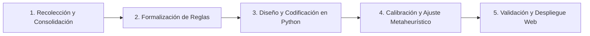

# Timetabling Colegio Madres Dominicas (MMDD)
### Herramienta de Apoyo Algorítmico para la Programación de Horarios Escolares

[](https://www.udec.cl)
[-A32638?style=flat-square)](#créditos-y-equipo)
[](https://www.python.org/)
[](#metodología-de-solución)

Este repositorio contiene el desarrollo, formulación matemática, algoritmos de optimización (metaheurísticas) y plataforma de visualización para la **generación y programación automatizada de horarios semanales** del **Colegio Madres Dominicas** (Concepción, Chile).

---

## 📋 Tabla de Contenidos
1. [Introducción y Contexto del Proyecto](#-introducción-y-contexto-del-proyecto)
2. [Estructura de Cursos y Niveles](#-estructura-de-cursos-y-niveles)
3. [Parámetros del Sistema: Dotación Docente](#-parámetros-del-sistema-dotación-docente)
4. [Cargas Horarias Curriculares por Nivel](#-cargas-horarias-curriculares-por-nivel)
5. [Estructura de Bloques Horarios y Jornadas](#-estructura-de-bloques-horarios-y-jornadas)
6. [Restricciones del Modelo de Optimización](#-restricciones-del-modelo-de-optimización)
   - [Restricciones Duras (Hard Constraints)](#1-restricciones-duras-hard-constraints)
   - [Restricciones Blandas / Criterios de Calidad (Soft Constraints)](#2-restricciones-blandas-criterios-de-calidad-soft-constraints)
7. [Arquitectura y Estructura del Repositorio](#-arquitectura-y-estructura-del-repositorio)
8. [Metodología de Solución](#-metodología-de-solución)
9. [Créditos y Equipo](#-créditos-y-equipo)

---

## 🏫 Introducción y Contexto del Proyecto

El **Colegio Madres Dominicas** es un establecimiento educacional con más de 130 años de historia ubicado en Concepción, Chile, que imparte enseñanza desde preescolar hasta 4° año de enseñanza media con jornada escolar completa.

### La Problemática: School Timetabling Problem (STP)
Tradicionalmente, la construcción de la malla horaria escolar se realiza de manera **manual**, basándose en métodos de prueba y error sobre planillas de cálculo. Esta tarea enfrenta una complejidad combinatoria crítica debido a:
* **Heterogeneidad de jornadas:** Distintos ciclos académicos finalizan su jornada en bloques distintos según el día de la semana.
* **Recursos compartidos:** Profesores de asignaturas especializadas y espacios restringidos (gimnasios, laboratorios de ciencias, salas de enlaces) compartidos entre múltiples niveles.
* **Electivos de formación diferenciada en 3° y 4° medio:** Los estudiantes de los cursos A y B se mezclan en secciones electivas simultáneas, obligando a coordinar bloques idénticos y sin solapamiento con el plan común.

### Objetivo General
Diseñar e implementar una **herramienta algorítmica basada en Python y metaheurísticas de optimización combinatoria** capaz de generar mallas horarias factibles, libres de colisiones y que optimicen la distribución de carga académica tanto para estudiantes como para docentes.

---

## 🎓 Estructura de Cursos y Niveles

El modelo abarca formalmente **24 cursos** (2 cursos paralelos, A y B, por cada nivel desde 1° básico hasta 4° medio):

| Ciclo Educativo | Niveles Comprendidos | N° Cursos por Nivel | Total Cursos |
| :--- | :--- | :---: | :---: |
| **Primer Ciclo Básico** | 1° Básico, 2° Básico, 3° Básico, 4° Básico | 2 (A y B) | **8 cursos** |
| **Segundo Ciclo Básico (Inicial)** | 5° Básico, 6° Básico | 2 (A y B) | **4 cursos** |
| **Segundo Ciclo Básico (Superior)** | 7° Básico, 8° Básico | 2 (A y B) | **4 cursos** |
| **Enseñanza Media (Inicial)** | 1° Medio, 2° Medio | 2 (A y B) | **4 cursos** |
| **Enseñanza Media (Diferenciada)** | 3° Medio, 4° Medio | 2 (A y B) | **4 cursos** |
| **Total Global del Modelo** | **1° Básico a 4° Medio** | **2 por nivel** | **24 cursos** |

---

## 👥 Parámetros del Sistema: Dotación Docente

La planta docente considerada en los parámetros del modelo se organiza por especialidad y rangos de niveles autorizados:

| Especialidad Docente | Cantidad | Rango de Niveles Habilitados | Funciones y Menciones Especiales |
| :--- | :---: | :---: | :--- |
| **Profesores de Educación Básica** | **8** | 1° Básico a 6° Básico | Divididos en dos perfiles:<br>• **Mención Matemática:** Dictan asignaturas de básica **excepto Lenguaje**.<br>• **Mención Lenguaje:** Dictan asignaturas de básica **excepto Matemática**.<br>• Cada docente tiene asignada obligatoriamente **1 hora semanal de Orientación** (Jefatura) en cursos de 1° a 4° básico. |
| **Profesores de Lenguaje (Media)** | **3** | 7° Básico a 4° Medio | Dictan Lenguaje y Comunicación / Lectura y Escritura Especializada. |
| **Profesores de Matemática (Media)** | **3** | 7° Básico a 4° Medio | Dictan Educación Matemática / Probabilidades y Estadística. |
| **Profesores de Inglés** | **6** | 1° Básico a 4° Medio | Dictan Idioma Extranjero Inglés en todos los niveles del colegio. |
| **Profesores de Historia** | **3** | 5° Básico a 4° Medio | Dictan Historia, Geografía y Ciencias Sociales / Educación Ciudadana. |
| **Profesores de Ciencias** | **4** | 6° Básico a 4° Medio | Incluye especialistas:<br>• **1 Profesor de Física**<br>• **1 Profesor de Química**<br>• **1 Profesor de Biología**<br>• *Nota de compatibilidad:* Química y Biología pueden impartir Ciencias Naturales en 5° y 6° básico. Los profesores de Física **no dictan** Ciencias Naturales. |
| **Profesor de Religión Básica** | **1** | 1° Básico a 6° Básico | Dicta Religión y Formación Valórica en ciclo básico. |
| **Profesor de Religión Media** | **1** | 7° Básico a 4° Medio | Dicta Religión y Formación Valórica en ciclo medio. |
| **Profesores de Educación Física** | **3** | 1° Básico a 4° Medio | Dictan Educación Física y Salud en todos los niveles (uso de gimnasio). |
| **Profesores de Artes y Tecnología** | **2** | 5° Básico a 4° Medio | Dictan Artes Visuales y Educación Tecnológica. |
| **Profesor de Música** | **1** | 5° Básico a 4° Medio | Dicta Educación Musical. |
| **Profesor de Filosofía** | **1** | 3° Medio y 4° Medio | Dicta Filosofía común y electivos afines. |

---

## 📚 Cargas Horarias Curriculares por Nivel

Cada curso cuenta con una exigencia semanal de horas pedagógicas (bloques lectivos de 1 hora) fijadas por el plan curricular del establecimiento y el Ministerio de Educación:

### 1. Primer Ciclo Básico: 1°, 2°, 3° y 4° Básico
> **Carga Semanal Total:** 36 horas pedagógicas

* **Lenguaje y Comunicación:** 8 horas
* **Educación Matemática:** 6 horas
* **Idioma Extranjero Inglés:** 6 horas
* **Ciencias Naturales:** 3 horas
* **Ciencias Sociales / Historia:** 3 horas
* **Educación Física y Salud:** 3 horas
* **Artes Visuales:** 2 horas
* **Educación Musical:** 2 horas
* **Religión:** 2 horas
* **Orientación:** 1 hora *(impartida obligatoriamente por el profesor/a jefe de básica)*

---

### 2. Segundo Ciclo Básico: 5° y 6° Básico
> **Carga Semanal:** 37 horas pedagógicas

* **Lenguaje y Comunicación:** 6 horas
* **Educación Matemática:** 6 horas
* **Idioma Extranjero Inglés:** 6 horas
* **Historia, Geografía y Ciencias Sociales:** 4 horas
* **Ciencias Naturales:** 4 horas
* **Educación Física y Salud:** 2 horas
* **Artes Visuales:** 2 horas
* **Educación Tecnológica:** 2 horas
* **Educación Musical:** 2 horas
* **Religión:** 2 horas
* **Orientación:** 1 hora

---

### 3. Segundo Ciclo Básico Superior: 7° y 8° Básico
> **Carga Semanal:** 38 horas pedagógicas

* **Lenguaje y Comunicación:** 6 horas
* **Educación Matemática:** 6 horas
* **Idioma Extranjero Inglés:** 6 horas
* **Historia, Geografía y Ciencias Sociales:** 4 horas
* **Ciencias Naturales:** 4 horas
* **Física:** 1 hora
* **Educación Física y Salud:** 2 horas
* **Artes Visuales:** 2 horas
* **Educación Tecnológica:** 2 horas
* **Educación Musical:** 2 horas
* **Religión:** 2 horas
* **Orientación:** 1 hora

---

### 4. Enseñanza Media Inicial: 1° y 2° Medio
> **Carga Semanal:** 39 horas pedagógicas

* **Lenguaje y Comunicación:** 6 horas
* **Educación Matemática:** 6 horas
* **Idioma Extranjero Inglés:** 6 horas
* **Historia, Geografía y Ciencias Sociales:** 4 horas
* **Biología:** 4 horas
* **Química:** 2 horas
* **Física:** 2 horas
* **Educación Tecnológica:** 2 horas
* **Artes Visuales y Música:** 2 horas
* **Educación Física y Salud:** 2 horas
* **Religión:** 2 horas
* **Orientación:** 1 hora

---

### 5. Enseñanza Media Superior: 3° y 4° Medio
> **Plan Común Base:** 22 horas pedagógicas (+ Asignaturas de Formación Diferenciada/Electivos hasta completar jornada semanal de hasta 42 bloques disponibles)

* **Lenguaje y Comunicación:** 3 horas
* **Educación Matemática:** 3 horas
* **Idioma Extranjero Inglés:** 4 horas
* **Educación Ciudadana:** 2 horas
* **Ciencias para la Ciudadanía:** 2 horas
* **Filosofía:** 2 horas
* **Física:** 1 hora
* **Educación Física y Salud:** 2 horas
* **Religión:** 2 horas
* **Orientación:** 1 hora
* **Módulos de Formación Diferenciada (Electivos):** Secciones simultáneas entre cursos A y B (Lectura Especializada, Probabilidades y Estadística, Biología Celular, Química Diferenciada, Historia del Presente, Economía y Sociedad).

---

## ⏱️ Estructura de Bloques Horarios y Jornadas

La jornada escolar está compuesta por bloques pedagógicos de **1 hora** (o módulos de 40-45 minutos organizados en bloques secuenciales). Los límites diarios de clases varían por ciclo educativo:

| Nivel / Ciclo | Lunes | Martes | Miércoles | Jueves | Viernes | Total Bloques Disponibles Semanal |
| :--- | :---: | :---: | :---: | :---: | :---: | :---: |
| **1° a 4° Básico** | Bloques 1 a 8 | Bloques 1 a 7 | Bloques 1 a 7 | Bloques 1 a 7 | Bloques 1 a 7 | **36 bloques** |
| **5° Básico** | Bloques 1 a 8 | Bloques 1 a 8 | Bloques 1 a 8 | Bloques 1 a 6 | Bloques 1 a 6 | **36 bloques** |
| **6° a 8° Básico** | Bloques 1 a 8 | Bloques 1 a 8 | Bloques 1 a 6 | Bloques 1 a 8 | Bloques 1 a 6 | **36 bloques** |
| **1° y 2° Medio** | Bloques 1 a 8 | Bloques 1 a 8 | Bloques 1 a 8 | Bloques 1 a 8 | Bloques 1 a 8 | **40 bloques** |
| **3° y 4° Medio** | Bloques 1 a 10 *(tarde)* | Bloques 1 a 8 | Bloques 1 a 8 | Bloques 1 a 8 | Bloques 1 a 8 | **42 bloques** |

> **Nota sobre la jornada de la tarde:**
> Los bloques 9 y 10 (jornada de la tarde, posterior a colación) aplican **exclusivamente los días lunes para 3° y 4° medio**. El resto de la semana y los demás ciclos operan íntegramente en horario matutino.

---

## 🔒 Restricciones del Modelo de Optimización

El problema de asignación se formula mediante un modelo matemático que diferencia estrictamente entre restricciones duras (factibilidad) y blandas (calidad de servicio).

### 1. Restricciones Duras (Hard Constraints)
Deben cumplirse en el 100% de los casos para que un horario sea considerado factible:

1. **Especialidad y Habilitación por Nivel:**
   * Ningún profesor puede impartir asignaturas fuera de su especialidad ni fuera de su rango de niveles permitido.
   * **Profesores de básica mención Matemática:** Pueden impartir asignaturas de ciclo básico (1° a 6°), **a excepción de Lenguaje**.
   * **Profesores de básica mención Lenguaje:** Pueden impartir asignaturas de ciclo básico (1° a 6°), **a excepción de Matemática**.
   * **Profesores de Matemática (Media):** Restringidos al rango de 7° básico a 4° medio.
   * **Profesores de Lenguaje (Media):** Restringidos al rango de 7° básico a 4° medio.
   * **Profesores de Inglés:** Habilitados para impartir desde 1° básico hasta 4° medio.
   * **Profesores de Historia:** Habilitados para impartir desde 5° básico hasta 4° medio.
   * **Profesores de Ciencias:** Habilitados desde 6° básico hasta 4° medio. **Los profesores de Física no pueden dictar Ciencias Naturales**.
   * **Profesor de Religión Básica:** Imparte exclusivamente de 1° a 6° básico.
   * **Profesor de Religión Media:** Imparte exclusivamente de 7° básico a 4° medio.
   * **Profesor de Filosofía:** Imparte exclusivamente en 3° y 4° medio.
   * **Profesores de Educación Física:** Habilitados de 1° básico a 4° medio.
   * **Profesores de Artes y Tecnología:** Habilitados de 5° básico a 4° medio.
   * **Profesor de Música:** Habilitado de 5° básico a 4° medio.

2. **No Solapamiento Docente (Clash-Free Teacher):**
   * Un docente no puede estar asignado a más de un curso o sección en un mismo bloque horario $t$.

3. **No Solapamiento de Cursos (Single Course Occupancy):**
   * Un curso $c$ solo puede recibir una asignatura o actividad pedagógica en cada bloque horario $t$.

4. **Cumplimiento Estricto de Cargas Horarias:**
   * La suma total de bloques asignados a cada asignatura en la semana debe ser exactamente igual a la carga curricular exigida por curso.

5. **Orientación y Jefatura en Básica:**
   * A cada uno de los 8 profesores de básica le corresponde obligatoriamente la hora semanal de Orientación en un curso de 1° a 4° básico.

6. **Coordinación y Simultaneidad de Electivos (3° y 4° Medio):**
   * Los bloques destinados a las asignaturas de formación diferenciada deben programarse de manera coordinada y simultánea para las secciones paralelas A y B de cada nivel, impidiendo choques con asignaturas del plan común.

7. **Restricción de Capacidad en Espacios Físicos Compartidos:**
   * El gimnasio del colegio no puede albergar más cursos de Educación Física que su capacidad simultánea permitida.
   * Laboratorios de ciencias y salas de electivos no admiten solapamiento entre distintas secciones.

---

### 2. Restricciones Blandas / Criterios de Calidad (Soft Constraints)
Definen la función de evaluación (fitness) para seleccionar la mejor solución entre múltiples opciones factibles:

* **Minimización de Bloques Libres Docentes ("Ventanas"):** Compactar la jornada laboral de los profesores para evitar esperas intermedias improductivas.
* **Distribución Semanal Equilibrada:** Distribuir asignaturas de alta carga cognitiva (como Matemática y Lenguaje) a lo largo de los días de la semana, evitando sobrecargas en un solo día.
* **Bloques Pedagógicos Dobles Contiguos:** Priorizar que asignaturas prácticas o de experimentación (Educación Física, Artes, Tecnología, Laboratorio de Ciencias) se programen en bloques consecutivos de 2 horas.
* **Control de Carga Diaria:** Balancear la intensidad académica diaria de los cursos.

---

## 📁 Arquitectura y Estructura del Repositorio

```text
Horarios-MMDD/
├── data/                                # Datos de entrada y planillas oficiales del colegio
│   ├── HORARIO CURSOS (1).xlsx          # Mallas horarias de referencia por curso y espacio
│   └── PROPUESTA HORARIA_MATIAS (1).xls # Propuesta de distribución y dotación docente
├── notebooks/                           # Jupyter Notebooks de experimentación y prototipado
├── Presentacion de avance/              # Documentación de entregas académicas
│   ├── Presentacion_Avance1_Grupo5.html # Presentación interactiva del proyecto (Informe de Avance)
│   └── Presentacion_Avance1_Grupo5.pdf  # Versión PDF de la presentación
├── Paginas Web/                         # Plataforma web para visualización de mallas horarias
├── .gitignore                           # Archivos y temporales ignorados por Git
└── README.md                            # Documentación integral del repositorio
```

---

## 🔬 Metodología de Solución

El proyecto avanza a través de 5 etapas estructuradas:



1. **Recolección y Consolidación:** Verificación y cruce de datos oficiales con la contraparte del colegio (dotación definitiva, electivos y disponibilidad).
2. **Formalización de Reglas:** Modelamiento formal del problema de programación entera / optimización combinatoria.
3. **Diseño y Codificación:** Implementación de algoritmos heurísticos y metaheurísticos en Python (Búsqueda Local Iterada, Algoritmos Genéticos / ILS).
4. **Calibración y Ajuste:** Afinamiento de parámetros computacionales y ponderaciones de la función de aptitud frente a la escala combinatoria real.
5. **Validación y Despliegue:** Contraste de horarios generados versus horarios manuales históricos y despliegue en la plataforma web interactiva.

---

## 👥 Créditos y Equipo

Proyecto desarrollado en el marco de la carrera de **Ingeniería Civil Industrial**, Universidad de Concepción.

* **Asignatura:** Taller de Gestión de Operaciones (TGOP) — Semestre 2026-2
* **Profesor Guía:** Eduardo Salazar Hornig
* **Estudiantes (Grupo 5):**
  * Carlos Pacheco
  * Ignacio Valenzuela
  * Matías Rocha

---
*“Saber más para servir mejor”* — Colegio Madres Dominicas, Concepción.
