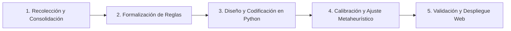

# Timetabling Colegio Madres Dominicas (MMDD)
### Herramienta de Apoyo Algorítmico para la Programación de Horarios Escolares

[](https://www.udec.cl)
[-A32638?style=flat-square)](#créditos-y-equipo)
[](https://www.python.org/)
[](#metodología-de-solución)

Este repositorio contiene el desarrollo, formulación matemática, algoritmos de optimización (metaheurísticas) y plataforma de visualización para la **generación y programación automatizada de horarios semanales** del **Colegio Madres Dominicas** (Concepción, Chile).

---

## 📋 Tabla de Contenidos
1. [Introducción y Contexto del Proyecto](#-introducción-y-contexto-del-proyecto)
2. [Estructura de Cursos y Niveles](#-estructura-de-cursos-y-niveles)
3. [Parámetros del Sistema: Dotación Docente](#-parámetros-del-sistema-dotación-docente)
4. [Cargas Horarias Curriculares por Nivel](#-cargas-horarias-curriculares-por-nivel)
5. [Estructura de Bloques Horarios y Jornadas](#-estructura-de-bloques-horarios-y-jornadas)
6. [Restricciones del Modelo de Optimización](#-restricciones-del-modelo-de-optimización)
   - [Restricciones Duras (Hard Constraints)](#1-restricciones-duras-hard-constraints)
   - [Restricciones Blandas / Criterios de Calidad (Soft Constraints)](#2-restricciones-blandas-criterios-de-calidad-soft-constraints)
7. [Arquitectura y Estructura del Repositorio](#-arquitectura-y-estructura-del-repositorio)
8. [Metodología de Solución](#-metodología-de-solución)
9. [Créditos y Equipo](#-créditos-y-equipo)

---

## 🏫 Introducción y Contexto del Proyecto

El **Colegio Madres Dominicas** es un establecimiento educacional con más de 130 años de historia ubicado en Concepción, Chile, que imparte enseñanza desde preescolar hasta 4° año de enseñanza media con jornada escolar completa.

### La Problemática: School Timetabling Problem (STP)
Tradicionalmente, la construcción de la malla horaria escolar se realiza de manera **manual**, basándose en métodos de prueba y error sobre planillas de cálculo. Esta tarea enfrenta una complejidad combinatoria crítica debido a:
* **Heterogeneidad de jornadas:** Distintos ciclos académicos finalizan su jornada en bloques distintos según el día de la semana.
* **Recursos compartidos:** Profesores de asignaturas especializadas y espacios restringidos (gimnasios, laboratorios de ciencias, salas de enlaces) compartidos entre múltiples niveles.
* **Electivos de formación diferenciada en 3° y 4° medio:** Los estudiantes de los cursos A y B se mezclan en secciones electivas simultáneas, obligando a coordinar bloques idénticos y sin solapamiento con el plan común.

### Objetivo General
Diseñar e implementar una **herramienta algorítmica basada en Python y metaheurísticas de optimización combinatoria** capaz de generar mallas horarias factibles, libres de colisiones y que optimicen la distribución de carga académica tanto para estudiantes como para docentes.

---

## 🎓 Estructura de Cursos y Niveles

El modelo abarca formalmente **24 cursos regulares** (2 cursos paralelos, A y B, por cada nivel desde 1° básico hasta 4° medio):

| Ciclo Educativo | Niveles Comprendidos | N° Cursos por Nivel | Total Cursos |
| :--- | :--- | :---: | :---: |
| **Primer Ciclo Básico** | 1° Básico, 2° Básico, 3° Básico, 4° Básico | 2 (A y B) | **8 cursos** |
| **Segundo Ciclo Básico (Inicial)** | 5° Básico, 6° Básico | 2 (A y B) | **4 cursos** |
| **Segundo Ciclo Básico (Superior)** | 7° Básico, 8° Básico | 2 (A y B) | **4 cursos** |
| **Enseñanza Media (Inicial)** | 1° Medio, 2° Medio | 2 (A y B) | **4 cursos** |
| **Enseñanza Media (Diferenciada)** | 3° Medio, 4° Medio | 2 (A y B) | **4 cursos** |
| **Total Global del Modelo** | **1° Básico a 4° Medio** | **2 por nivel** | **24 cursos** |

> **Nota sobre Educación Parvularia en los Datos Institucionales:**
> En los registros oficiales del establecimiento (`HORARIO CURSOS (1).xlsx` y `PROPUESTA HORARIA_MATIAS (1).xls`), el colegio cuenta además con niveles de educación parvularia (**Prekínder A, Kínder A y Kínder B**). Aunque el motor de optimización matemática enfoca la programación automática en los 24 cursos regulares (1° básico a 4° medio), las secciones de párvulos están presentes en los datos de entrada debido a que comparten recursos críticos como docentes de Educación Física y espacios deportivos.

---

## 👥 Parámetros del Sistema: Dotación Docente

La planta docente documentada en la propuesta oficial del colegio (`PROPUESTA HORARIA_MATIAS (1).xls`) contempla **46 docentes / asignaciones docentes**, organizados por especialidad, departamentos y rangos de niveles autorizados:

| Especialidad Docente | Cantidad en Planilla | Rango de Niveles Habilitados | Funciones, Menciones y Asignaciones Reales |
| :--- | :---: | :---: | :--- |
| **Profesores de Educación Básica** | **8** | 1° Básico a 6° Básico | Divididos en dos perfiles:<br>• **Mención Matemática (4):** Dictan Matemática (1°-4° y 5°), Ciencias Naturales, Ciencias Sociales, Artes Visuales y Orientación/Tecnología.<br>• **Mención Lenguaje (4):** Dictan Lenguaje (1°-4° y 5°-6°), Ciencias Naturales, Ciencias Sociales, Música y Orientación/Tecnología.<br>• Cada docente tiene asignada obligatoriamente **1 hora semanal integrada de Orientación y Tecnología** (Jefatura) en cursos de 1° a 4° básico. |
| **Profesores de Lenguaje** | **7** | 5° Básico a 4° Medio | • **4 docentes de Básica/Media Inicial:** Dictan Lenguaje en 5° y 6° básico (`Profesor lenguaje 1` a `4`).<br>• **3 docentes de Media Superior:** Dictan Lenguaje de 7° básico a 4° medio (`Profesor lenguaje 5` a `7`), asignaturas de profundización (Lectura y Escritura Especializada, Taller de Literatura, Participación y Argumentación) y Jefatura de Departamento. |
| **Profesores de Matemática** | **6** | 5° Básico a 4° Medio | • **2 docentes de Básica Inicial:** Dictan Matemática en 5° básico (`Profesor matemática 1` y `2`).<br>• **1 docente de Básica Superior:** Dicta Matemática de 6° a 8° básico (`Profesor matemática 4`).<br>• **3 docentes de Media:** Dictan Matemática en Media (`Profesor matemática 3`, `5` y `6`), cubriendo 1° a 4° medio (7 hrs en 1°-2° medio, 3 hrs en 3°-4° medio), electivos (Probabilidades y Estadística, Límites y Derivadas) y Jefatura de Departamento. |
| **Profesores de Inglés** | **6** | 1° Básico a 4° Medio | Dictan Idioma Extranjero Inglés en todos los niveles del colegio (`Profesor Inglés 1` a `6`) y Jefatura de Departamento. |
| **Profesores de Historia** | **3** | 5° Básico a 4° Medio | Dictan Historia, Geografía y Ciencias Sociales, Educación Ciudadana y electivos de formación diferenciada (Comprensión Histórica del Presente, Geografía y Problemas Socioambientales, Economía y Sociedad), además de Jefatura de Departamento (`Profesor Historia 1` a `3`). |
| **Profesores de Ciencias** | **7** | 5° Básico a 4° Medio | • **2 docentes:** Dictan Ciencias Naturales en 5° básico (`Profesor de Ciencias 1` y `2`).<br>• **1 Profesor de Química:** Cubre Química en 1°-2° medio, Ciencias para la Ciudadanía en 4° medio, Ciencias Naturales en 6°B, electivo Química Diferenciada en 3° medio y Jefatura de Departamento (`Profesor Ciencias 3`).<br>• **2 Profesores de Biología:** Cubren Biología en 1°-2° medio, Ciencias para la Ciudadanía en 3° medio, Ciencias Naturales en 6°A y 8°A, y electivos de Biología Celular y Biología de los Ecosistemas (`Profesor de Ciencias 4` y `6`).<br>• **1 Profesor de Cs. Naturales:** Cubre Ciencias Naturales en 7°A, 7°B y 8°B (`Profesor de Ciencias 5`).<br>• **1 Profesor de Física:** Dicta Física transversalmente desde 7° básico hasta 4° medio (`Profesor de Ciencias 7`). |
| **Profesores de Religión y Filosofía** | **3** | 1° Básico a 4° Medio | Agrupados en el departamento institucional:<br>• **Profesor Religión 1:** Dicta Religión y Formación Valórica de 1° a 6° básico.<br>• **Profesor Religión 2:** Dicta **Filosofía** en 3° y 4° medio.<br>• **Profesor Religión 3:** Dicta Religión de 7° básico a 4° medio. |
| **Profesores de Artes, Tecnología y Música** | **3** | 5° Básico a 4° Medio | • **Profesor 1 (Tecnología):** Dicta Educación Tecnológica de 5° básico a 2° medio (y Artes en 7°B).<br>• **Profesor 2 (Artes Visuales):** Dicta Artes Visuales de 5° básico a 4° medio (y Tecnología en 8° básico).<br>• **Profesor 3 (Música):** Dicta Educación Musical de 5° básico a 4° medio. |
| **Profesores de Educación Física** | **3** | Prekínder a 4° Medio | Dictan Educación Física y Salud en todos los niveles (`PROFESOR ED 1`, `2` y `3`), cubriendo también los niveles de educación parvularia. |
| **Total Planta Docente en Planilla Oficial** | **46** | **Prekínder a 4° Medio** | **Dotación completa de asignaciones docentes del colegio** |

---

## 📚 Cargas Horarias Curriculares por Nivel

Cada curso cuenta con una exigencia semanal de horas pedagógicas (bloques lectivos de 1 hora) fijadas por el plan curricular del establecimiento y el Ministerio de Educación, validadas directamente con las mallas de `HORARIO CURSOS (1).xlsx`:

### 1. Primer Ciclo Básico: 1°, 2°, 3° y 4° Básico
> **Carga Semanal Total:** 36 horas pedagógicas

* **Lenguaje y Comunicación:** 8 horas
* **Educación Matemática:** 6 horas
* **Idioma Extranjero Inglés:** 6 horas
* **Ciencias Naturales:** 3 horas
* **Ciencias Sociales / Historia:** 3 horas
* **Educación Física y Salud:** 3 horas
* **Artes Visuales:** 2 horas
* **Educación Musical:** 2 horas
* **Religión:** 2 horas
* **Orientación y Tecnología (Integrada):** 1 hora *(sesión semanal de 1 bloque pedagógico `C.ORIEN./TEC.` que integra curricularmente 0.5 horas de Orientación y 0.5 horas de Educación Tecnológica, impartida por el/la profesor/a jefe de básica)*

---

### 2. Segundo Ciclo Básico: 5° y 6° Básico
> **Carga Semanal Total:** 37 horas pedagógicas

* **Lenguaje y Comunicación:** 6 horas
* **Educación Matemática:** 6 horas
* **Idioma Extranjero Inglés:** 6 horas
* **Historia, Geografía y Ciencias Sociales:** 4 horas
* **Ciencias Naturales:** 4 horas
* **Educación Física y Salud:** 2 horas
* **Artes Visuales:** 2 horas
* **Educación Tecnológica:** 2 horas
* **Educación Musical:** 2 horas
* **Religión:** 2 horas
* **Orientación:** 1 hora

---

### 3. Segundo Ciclo Básico Superior: 7° y 8° Básico
> **Carga Semanal Total:** 37 horas pedagógicas

* **Lenguaje y Comunicación:** 6 horas
* **Educación Matemática:** 6 horas
* **Idioma Extranjero Inglés:** 6 horas
* **Historia, Geografía y Ciencias Sociales:** 4 horas
* **Ciencias Naturales:** 4 horas
* **Física:** 1 hora
* **Educación Física y Salud:** 2 horas
* **Artes Visuales:** 2 horas
* **Educación Tecnológica:** 1 hora *(a diferencia de 5° y 6° que tienen 2 horas)*
* **Educación Musical:** 2 horas
* **Religión:** 2 horas
* **Orientación:** 1 hora

---

### 4. Enseñanza Media Inicial: 1° y 2° Medio
> **Carga Semanal Total:** 40 horas pedagógicas

* **Lenguaje y Comunicación:** 6 horas
* **Educación Matemática:** 7 horas *(plan reforzado de 7 horas semanales en 1° y 2° medio)*
* **Idioma Extranjero Inglés:** 6 horas
* **Historia, Geografía y Ciencias Sociales:** 4 horas
* **Biología:** 4 horas
* **Química:** 2 horas
* **Física:** 2 horas
* **Educación Tecnológica:** 2 horas
* **Artes Visuales:** 2 horas
* **Educación Física y Salud:** 2 horas
* **Religión:** 2 horas
* **Orientación:** 1 hora

---

### 5. Enseñanza Media Superior: 3° y 4° Medio
> **Carga Semanal Total:** 42 horas pedagógicas (24 horas Plan Común Base + 18 horas Formación Diferenciada / Electivos)

**Plan Común Base (24 horas pedagógicas):**
* **Lenguaje y Comunicación:** 3 horas
* **Educación Matemática:** 3 horas
* **Idioma Extranjero Inglés:** 4 horas
* **Educación Ciudadana:** 2 horas
* **Ciencias para la Ciudadanía:** 2 horas
* **Filosofía:** 2 horas
* **Física:** 1 hora
* **Artes Visuales:** 2 horas
* **Educación Física y Salud:** 2 horas
* **Religión:** 2 horas
* **Orientación:** 1 hora

**Módulos de Formación Diferenciada (18 horas pedagógicas):**
3 asignaturas electivas por curso de 6 horas semanales cada una, programadas en bloques simultáneos y coordinados entre cursos paralelos A y B:
* **En 3° Medio:**
  * *Lectura y Escritura Especializada* (6 hrs)
  * *Comprensión Histórica del Presente* (6 hrs)
  * *Probabilidades y Estadística Descriptiva* (6 hrs)
  * *Química Formación Diferenciada* (6 hrs)
  * *Biología Celular y Molecular* (6 hrs)
  * *Economía y Sociedad* (6 hrs)
* **En 4° Medio:**
  * *Taller de Literatura* (6 hrs)
  * *Límites, Derivadas e Integrales* (6 hrs)
  * *Participación y Argumentación en Democracia* (6 hrs)
  * *Geografía, Territorio y Problemas Socioambientales* (6 hrs)
  * *Biología de los Ecosistemas* (6 hrs, 4° Medio A) / *Ciencias para la Salud* (6 hrs, 4° Medio B)

---

## ⏱️ Estructura de Bloques Horarios y Jornadas

La jornada escolar está compuesta por bloques pedagógicos de **1 hora** (o módulos de 40-45 minutos organizados en bloques secuenciales). Los límites diarios y totales semanales de bloques disponibles coinciden exactamente con la carga curricular oficial:

| Nivel / Ciclo | Lunes | Martes | Miércoles | Jueves | Viernes | Total Bloques Disponibles Semanal | Carga Curricular Requerida |
| :--- | :---: | :---: | :---: | :---: | :---: | :---: | :---: |
| **1° a 4° Básico** | Bloques 1 a 8 | Bloques 1 a 7 | Bloques 1 a 7 | Bloques 1 a 7 | Bloques 1 a 7 | **36 bloques** | **36 horas** |
| **5° Básico** | Bloques 1 a 8 | Bloques 1 a 8 | Bloques 1 a 8 | Bloques 1 a 7 | Bloques 1 a 6 | **37 bloques** | **37 horas** |
| **6° a 8° Básico** | Bloques 1 a 8 | Bloques 1 a 8 | Bloques 1 a 7 *(o 6)* | Bloques 1 a 8 | Bloques 1 a 6 *(o 7)* | **37 bloques** | **37 horas** |
| **1° y 2° Medio** | Bloques 1 a 8 | Bloques 1 a 8 | Bloques 1 a 8 | Bloques 1 a 8 | Bloques 1 a 8 | **40 bloques** | **40 horas** |
| **3° y 4° Medio** | Bloques 1 a 10 *(tarde)* | Bloques 1 a 8 | Bloques 1 a 8 | Bloques 1 a 8 | Bloques 1 a 8 | **42 bloques** | **42 horas** |

> **Nota sobre la jornada de la tarde:**
> Los bloques 9 y 10 (jornada de la tarde, posterior a colación de 14:20 a 14:50) aplican **exclusivamente los días lunes para 3° y 4° medio**. El resto de la semana y los demás ciclos operan íntegramente en horario matutino hasta el bloque 8 (14:20 hrs) o anterior.

---

## 🔒 Restricciones del Modelo de Optimización

El problema de asignación se formula mediante un modelo matemático que diferencia estrictamente entre restricciones duras (factibilidad) y blandas (calidad de servicio).

### 1. Restricciones Duras (Hard Constraints)
Deben cumplirse en el 100% de los casos para que un horario sea considerado factible:

1. **Especialidad y Habilitación por Nivel:**
   * Ningún profesor puede impartir asignaturas fuera de su especialidad ni fuera de su rango de niveles permitido, según la planta oficial de 46 docentes:
   * **Profesores de Educación Básica (8):** Mención Matemática (imparten asignaturas de ciclo básico 1° a 6° excepto Lenguaje) y Mención Lenguaje (imparten ciclo básico 1° a 6° excepto Matemática).
   * **Profesores de Lenguaje (7):** `Profesor lenguaje 1` a `4` asignados al ciclo básico inicial (5° y 6° básico); `Profesor lenguaje 5` a `7` habilitados de 7° básico a 4° medio y electivos de profundización.
   * **Profesores de Matemática (6):** `Profesor matemática 1` y `2` asignados a 5° básico; `Profesor matemática 4` a cargo de 6° a 8° básico; `Profesor matemática 3`, `5` y `6` habilitados en enseñanza media (1° a 4° medio) y electivos.
   * **Profesores de Inglés (6):** Habilitados para impartir desde 1° básico hasta 4° medio.
   * **Profesores de Historia (3):** Habilitados para impartir desde 5° básico hasta 4° medio y electivos del área.
   * **Profesores de Ciencias (7):** Profesores 1 y 2 en 5° básico; Profesor 3 en Química y Cs. Naturales 6°B; Profesores 4 y 6 en Biología y electivos; Profesor 5 en Cs. Naturales (7° y 8°B); Profesor 7 en Física transversal (7° básico a 4° medio).
   * **Profesores de Religión y Filosofía (3):** Profesor Religión 1 (1° a 6° básico), Profesor Religión 2 (Filosofía en 3° y 4° medio) y Profesor Religión 3 (Religión de 7° básico a 4° medio).
   * **Profesores de Artes, Tecnología y Música (3):** Profesor 1 en Tecnología (5° a 2° medio), Profesor 2 en Artes Visuales (5° a 4° medio) y Profesor 3 en Música (5° a 4° medio).
   * **Profesores de Educación Física (3):** Habilitados desde educación parvularia (Prekínder y Kínder) hasta 4° medio.

2. **No Solapamiento Docente (Clash-Free Teacher):**
   * Un docente no puede estar asignado a más de un curso o sección en un mismo bloque horario $t$.

3. **No Solapamiento de Cursos (Single Course Occupancy):**
   * Un curso $c$ solo puede recibir una asignatura o actividad pedagógica en cada bloque horario $t$.

4. **Cumplimiento Estricto de Cargas Horarias:**
   * La suma total de bloques asignados a cada asignatura en la semana debe ser exactamente igual a la carga curricular exigida por curso (36 hrs en 1°-4° básico, 37 hrs en 5°-8° básico, 40 hrs en 1°-2° medio y 42 hrs en 3°-4° medio).

5. **Orientación y Jefatura en Básica:**
   * A cada uno de los 8 profesores de básica le corresponde obligatoriamente la hora semanal integrada de Orientación y Tecnología (`C.ORIEN./TEC.`) en un curso de 1° a 4° básico.

6. **Coordinación y Simultaneidad de Electivos (3° y 4° Medio):**
   * Los bloques destinados a las asignaturas de formación diferenciada (3 electivos de 6 horas por curso) deben programarse de manera coordinada y simultánea para las secciones paralelas A y B de cada nivel, impidiendo choques con asignaturas del plan común.

7. **Restricción de Capacidad en Espacios Físicos Compartidos:**
   * **Recintos Deportivos:** El establecimiento cuenta con **3 espacios diferenciados**: **Gimnasio A**, **Gimnasio B** y **Patio Santo Domingo**. Cada recinto solo puede albergar un curso por bloque lectivo (máximo 3 cursos simultáneos en Educación Física en el colegio, considerando básica, media y párvulos).
   * **Salas de Especialidad y Electivos:** La planilla oficial coordina **8 salas específicas** (*Electivo 1, Electivo 2, Electivo 3, Sala de Tecnología, Sala Padre Cueto, Sala Madre Pilar, Sala de Artes y Sala de Música*), las cuales no admiten solapamiento entre distintas secciones.
   * **Bloqueos Institucionales por Actividades Pastorales:** Determinados recintos (ej. Sala Padre Cueto, Sala Madre Pilar y Sala de Música) tienen franjas bloqueadas para actividades de pastoral escolar (*Comunidad Misionera* y *Amigos Servidores*), restringiendo su uso lectivo.

---

### 2. Restricciones Blandas / Criterios de Calidad (Soft Constraints)
Definen la función de evaluación (fitness) para seleccionar la mejor solución entre múltiples opciones factibles:

* **Minimización de Bloques Libres Docentes ("Ventanas"):** Compactar la jornada laboral de los profesores para evitar esperas intermedias improductivas.
* **Distribución Semanal Equilibrada:** Distribuir asignaturas de alta carga cognitiva (como Matemática y Lenguaje) a lo largo de los días de la semana, evitando sobrecargas en un solo día.
* **Bloques Pedagógicos Dobles Contiguos:** Priorizar que asignaturas prácticas o de experimentación (Educación Física, Artes, Tecnología, Laboratorio de Ciencias) se programen en bloques consecutivos de 2 horas.
* **Control de Carga Diaria:** Balancear la intensidad académica diaria de los cursos.

---

## 📁 Arquitectura y Estructura del Repositorio

```text
Horarios-MMDD/
├── data/                                # Datos de entrada y planillas oficiales del colegio
│   ├── HORARIO CURSOS (1).xlsx          # Mallas horarias de referencia por curso y espacio
│   └── PROPUESTA HORARIA_MATIAS (1).xls # Propuesta de distribución y dotación docente
├── notebooks/                           # Jupyter Notebooks de experimentación y prototipado
├── Presentacion de avance/              # Documentación de entregas académicas
│   ├── Presentacion_Avance1_Grupo5.html # Presentación interactiva del proyecto (Informe de Avance)
│   └── Presentacion_Avance1_Grupo5.pdf  # Versión PDF de la presentación
├── Paginas Web/                         # Plataforma web para visualización de mallas horarias
├── .gitignore                           # Archivos y temporales ignorados por Git
└── README.md                            # Documentación integral del repositorio
```

---

## 🔬 Metodología de Solución

El proyecto avanza a través de 5 etapas estructuradas:



1. **Recolección y Consolidación:** Verificación y cruce de datos oficiales con la contraparte del colegio (dotación definitiva, electivos y disponibilidad).
2. **Formalización de Reglas:** Modelamiento formal del problema de programación entera / optimización combinatoria.
3. **Diseño y Codificación:** Implementación de algoritmos heurísticos y metaheurísticos en Python (Búsqueda Local Iterada, Algoritmos Genéticos / ILS).
4. **Calibración y Ajuste:** Afinamiento de parámetros computacionales y ponderaciones de la función de aptitud frente a la escala combinatoria real.
5. **Validación y Despliegue:** Contraste de horarios generados versus horarios manuales históricos y despliegue en la plataforma web interactiva.

---

## 👥 Créditos y Equipo

Proyecto desarrollado en el marco de la carrera de **Ingeniería Civil Industrial**, Universidad de Concepción.

* **Asignatura:** Taller de Gestión de Operaciones (TGOP) — Semestre 2026-2
* **Profesor Guía:** Eduardo Salazar Hornig
* **Estudiantes (Grupo 5):**
  * Carlos Pacheco
  * Ignacio Valenzuela
  * Matías Rocha

---
*“Saber más para servir mejor”* — Colegio Madres Dominicas, Concepción.
